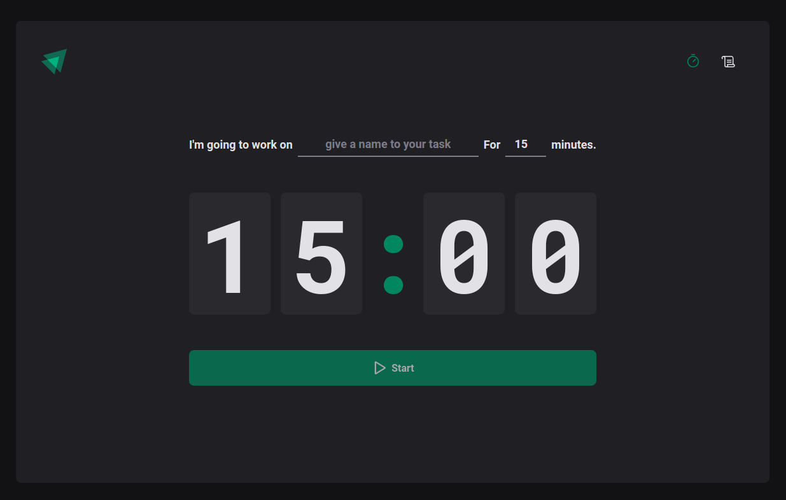

# React Pomodoro

A Pomodoro web app made with React.



This is a simple project made using many of React Hooks (useState, useCallback, useContext, useReducer). React Router Dom is used to control the navigation between pages and each pomodoro cycle is saved on the local storage. The supported features are:

- Pomodoro cycle countdown
- Cycles history
- Interrupt current cycle
- Remove specific cycle
- Remove all cycles
- Alarm sound when cycle ends
- Clockdown showing in the browser tab

## Built With

- React (Bootstrapped with [Vite](https://github.com/vitejs)),
- Typescript
- React Router Dom
- Styled Components
- Phosphor Icons

## Live Demo

[Live Demo Link](https://www.pomodoro.torres-ssf.com)


## Getting Started

To get a local copy up and running follow these simple example steps.

### Prerequisites

- Npm v8

### Setup

```
git clone https://github.com/Torres-ssf/react-pomodoro
```

```
cd react-pomodoro/
```

### Install

```
npm install
```

### Usage

```
npm run dev
```

## Authors

👤 **Sergio Torres**

- Github: [@Torres-ssf](https://github.com/Torres-ssf/)
- Linkedin: [torres-ssf](https://www.linkedin.com/in/torres-ssf/)

## 🤝 Contributing

Contributions, issues and feature requests are welcome!

## Show your support

Give a ⭐️ if you like this project!

## 📝 License

This project is [MIT](lic.url) licensed.
